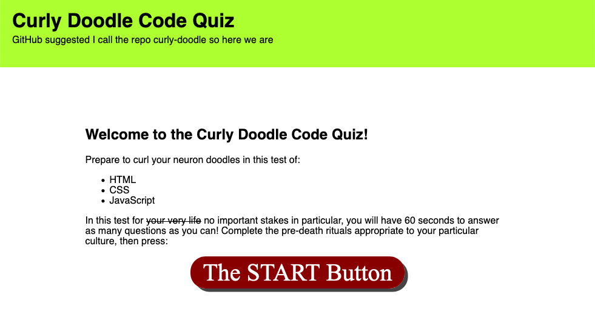
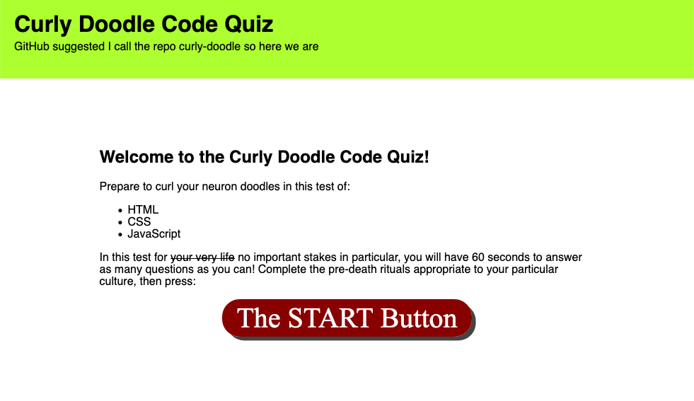

# Curly Doodle Code Quiz

The Curly Doodle Code Quiz, affectionately named by GitHub's auto-suggested repo name, is a single-page application that tests the user in various web development questions.

In summary, the app responds to user clicks by removing the contents of the `<main>` element and replacing them with the next item of content. Thus, clicking the `<button id="start">` removes the starting `
` and replaces it with the first question and its answer options. When a user selects an answer, the page provides feedback before removing that question's `
` and then generating a new one for the next question via a series of `createElement()` and `appendChild()` operations. This continues until all questions are completed or the timer reaches 0.

The slide-in animation causes each new panel to shift from the left to its normal position while opacity changes from 0 to 100%. Conversely, when a `
` is removed, the CSS class `exit` is added to the element via JavaScript, thus causing a simpler transition with an opposite effect of the slide-in animation.

When the quiz ends, a score submit `
` is rendered. The single click-based event listener that governed most of the app is removed and replaced with a slightly more flexible submit-based listener when the user is prompted to enter their initials for the high score listing. Score history is kept in localStorage and then retrieved when an attempt is completed.

